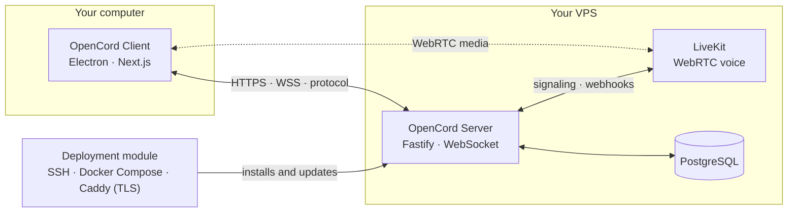
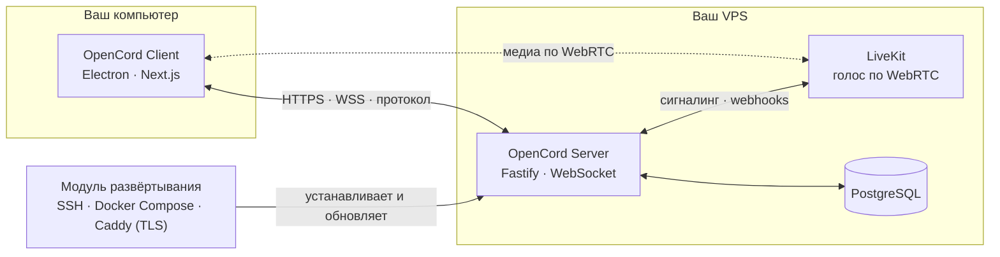
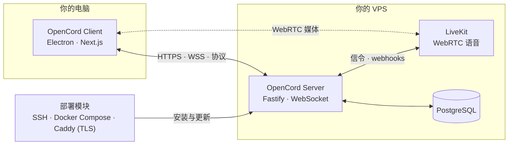

# OpenCord


**OpenCord** is an open-source, self-hosted alternative to Discord: you run your own OpenCord Server on a VPS you control and connect to it with the OpenCord Client to chat in text and voice channels.

> **Status: beta.** The project is at an early stage (v0.1.0-beta). The architecture, protocols and libraries can still change, and breaking changes are possible between releases. Do not rely on it for data you cannot afford to lose.

## Why OpenCord

- **No central account.** A user is identified by a cryptographic key pair (Ed25519) created locally. The private key never leaves the device and is never sent to the server or to other users.
- **You own the server.** Every OpenCord Server is a self-hosted instance: community data lives on hardware you control, not in a vendor's cloud.
- **Everything is open.** Client, server, the protocol contract and the deployment tooling live in this repository.

## What works today

- **Local identity** — creating an Ed25519 identity, profile and fingerprint; challenge-response login; identity reset with a clear warning. Reset creates a new identity and does not unlock the previous profile; recovery is possible only from a backup created in advance.
- **Text communication** — servers/spaces, text channels, sending, editing and deleting messages, history persisted in SQL.
- **Roles and permissions** — owner, administrator and member roles with server-side permission checks.
- **Profiles and attachments** — display names, avatars and banners; file attachments with per-server size limits.
- **Voice rooms** — WebRTC voice built on LiveKit (server-side SFU and signaling), push-to-talk and voice activation, RNNoise noise suppression with a WebRTC fallback. Voice is optional: a server without LiveKit still serves text chat.
- **Screen sharing** — with per-server quality and FPS limits.
- **VPS deployment module** — an SSH wizard built into the client (SSH keys preferred, host fingerprint confirmation) that installs a reproducible Docker Compose stack with TLS, plus `opencordctl` and a one-command `bootstrap.sh` for the command line.
- **Automatic client updates** — mandatory verified updates on Windows (NSIS), background update checks on macOS and Linux AppImage, manual downloads for deb.
- **Localized UI** — English, Russian and Chinese.
- **Versioned protocol** — a single Zod-schema protocol contract shared between client and server.

## Architecture



Three logically separated parts:

- **OpenCord Client** (`client/`) — Electron + Next.js desktop application: local profile, cryptographic identity, UI, voice and auto-update.
- **OpenCord Server** (`server/`) — Fastify API with WebSocket: channels, messages, roles, attachments and voice signaling; PostgreSQL in production, PGlite for local development (no Docker required).
- **Deployment module** (`deploy/`) — reproducible installation and updates on a VPS: SSH, Docker Compose, TLS.

## Repository structure

```text
OpenCord/
├── client/       # Electron + Next.js UI, local identity, updater
├── server/       # Fastify API + WebSocket, channels, roles, storage, voice signaling
├── deploy/       # SSH installer, Docker Compose, TLS, opencordctl, bootstrap.sh
├── shared/       # shared Zod schemas and the protocol contract
├── docs/         # architecture, security and deployment documentation
├── scripts/      # release and version helpers
└── .github/workflows/   # release pipeline
```

## Getting started

### Prerequisites

- Node.js ≥ 24 and pnpm ≥ 11. Both are pinned in `package.json` (`corepack` will pick up the right pnpm).
- Docker is **not** required for local development: the server runs on PGlite out of the box.

### Run locally

```bash
git clone https://github.com/uniquealexx/OpenCord.git
cd OpenCord
corepack enable
pnpm install
pnpm dev
```

`pnpm dev` starts:

- OpenCord Server on `http://127.0.0.1:3210`;
- the PGlite database in `server/.data/opencord`;
- the statically exported Next.js UI inside the Electron client.

In the client press «Connect», enter `http://127.0.0.1:3210` and confirm. The client creates a protected local Ed25519 identity, authenticates via challenge-response and loads the server's channels and history. On a temporary connection loss the client reconnects automatically.

> Note for Windows development: the Electron client runs the local static export without hot reload (the Next.js dev WebSocket is incompatible with the current configuration), so restart `pnpm dev` after UI changes. The server keeps reloading itself via `tsx watch`.

To test communication between two users, launch a second client instance with a separate user-data directory (or run the installed app under another Windows account). One data directory corresponds to one local cryptographic identity.

### Production-like local loop with Docker

If Docker is already running, you can exercise the production-like PostgreSQL stack:

```bash
pnpm docker:up
pnpm docker:logs
pnpm docker:down
```

This publishes only OpenCord Server on `http://127.0.0.1:3210`; PostgreSQL stays on the internal Docker network. `docker:down` does not remove the database volume.

### Server without the client

```bash
pnpm dev:server
curl http://127.0.0.1:3210/health
```

## Deploying a server to your VPS

The `+` button in the client opens the SSH deployment wizard: it verifies the host fingerprint and the Ubuntu environment, then offers the recommended Docker Compose installation (server, PostgreSQL, LiveKit and Caddy with TLS) or an explicit native installation of Node.js, PostgreSQL and a systemd service. You may skip the domain for a local test (for example in WSL), but then the server runs over plain HTTP on port 3210 and the wizard requires a separate risk confirmation. For a public VPS always use a domain: Caddy is installed, TLS is enabled and a public HTTPS health check is verified.

Full instructions, `opencordctl` commands, requirements and diagnostics: [`docs/deployment.md`](docs/deployment.md).

## Building installers

| Platform | Artifacts | Where it builds |
| --- | --- | --- |
| Windows | NSIS installer x64 | on Windows: `pnpm package:win` |
| Linux | AppImage + deb x64 | WSL2 or the CI ubuntu runner: `pnpm package:linux` |
| macOS | dmg + zip (universal) | CI macOS runner only: `pnpm package:mac` |

Details, artifact names and limitations: [`docs/build-targets.md`](docs/build-targets.md). Desktop artifacts are currently unsigned: Windows may show SmartScreen and macOS Gatekeeper will warn about the dmg. Apple code signing and notarization are planned before the first stable release.

## Checks and tests

```bash
pnpm lint
pnpm typecheck
pnpm test
pnpm build
```

## Documentation

| Document | Topic |
| --- | --- |
| [`docs/deployment.md`](docs/deployment.md) | VPS installation, `opencordctl`, requirements, diagnostics |
| [`docs/authorization.md`](docs/authorization.md) | owner, roles and permission checks |
| [`docs/protocol.md`](docs/protocol.md) | versioned WebSocket protocol contract |
| [`docs/health.md`](docs/health.md) | server version and the `/health` endpoint |
| [`docs/client-architecture.md`](docs/client-architecture.md) | client architecture |
| [`docs/client-updates.md`](docs/client-updates.md) | update channels and artifact verification |
| [`docs/release-manifest.md`](docs/release-manifest.md) | release manifest and the release pipeline |
| [`docs/build-targets.md`](docs/build-targets.md) | packaging targets for Windows, Linux and macOS |
| [`docs/voice-livekit-v1.md`](docs/voice-livekit-v1.md) | voice chat v1 |
| [`docs/voice-audio-processing.md`](docs/voice-audio-processing.md) | noise suppression and audio processing |
| [`docs/screen-sharing.md`](docs/screen-sharing.md) | screen sharing |
| [`docs/help-api.md`](docs/help-api.md) | Help Pages `api.*` builder reference (EN/RU/ZH) + Pages playground |

## Security and privacy

What is protected today:

- the private key is generated and stored locally using OS facilities and is never transmitted to the VPS or other users;
- only necessary public profile fields (display name, avatar, description, public key) are sent to the server;
- public deployments require TLS; local development deliberately uses plain HTTP with an explicit warning;
- the server enforces roles and permissions on its side;
- downloaded updates are verified by size and hash (SHA-256 from the release manifest on Windows; SHA-512 from update metadata on macOS/AppImage) over HTTPS from the canonical GitHub Release only;
- no telemetry or hidden data collection.

What is **not** claimed yet:

- **end-to-end encryption is not implemented** — assume the VPS administrator technically controls the data stored on the server; E2EE is a future direction that will be claimed only after implementation and verification;
- desktop artifacts are not code-signed yet (see above);
- the release manifest has no cryptographic signature yet.

Details: [`docs/client-updates.md`](docs/client-updates.md), [`docs/authorization.md`](docs/authorization.md).

## Roadmap

Towards the first stable release:

- stabilization of the text loop and the voice prototype, wider platform testing;
- Windows and macOS code signing, real-device verification of macOS/AppImage updates;
- a real logo and icons.

Later:

- end-to-end encryption (requires design, review and verification);
- federation between VPS instances;
- an apt repository for deb packages;
- SFU tuning for large group rooms and storage optimization.

## Contributing

Contributions are welcome. Before making changes, read `AGENTS.md` in the repository root — it describes the project rules, boundaries between the client/server/installer and testing requirements. New code is TypeScript with strict typing; protocol changes update the shared schemas, server, client and compatibility docs together; SQL changes are versioned migrations. Tests are required for authentication, permissions, migrations, message handling and installer failure scenarios.

## License

OpenCord is released under the [MIT License](LICENSE).

---

# OpenCord (Русский)


**OpenCord** — открытая децентрализованная альтернатива Discord: вы разворачиваете собственный OpenCord Server на своём VPS и подключаетесь к нему через OpenCord Client для общения в текстовых и голосовых каналах.

> **Статус: beta.** Проект на ранней стадии (v0.1.0-beta). Архитектура, протоколы и библиотеки ещё могут меняться, между релизами возможны ломающие изменения. Не полагайтесь на проект для данных, потерю которых вы не можете себе позволить.

## Зачем OpenCord

- **Без центральной учётной записи.** Пользователя идентифицирует криптографическая пара ключей (Ed25519), создаваемая локально. Приватный ключ никогда не покидает устройство и не передаётся ни серверу, ни другим пользователям.
- **Сервер принадлежит вам.** Любой OpenCord Server — самостоятельно размещённый экземпляр: данные сообщества лежат на вашем оборудовании, а не в чужом облаке.
- **Всё открыто.** Клиент, сервер, контракт протокола и инструменты развёртывания находятся в этом репозитории.

## Что уже работает

- **Локальная идентичность** — создание Ed25519-идентичности, профиля и fingerprint; вход по challenge-response; сброс ключей с ясным предупреждением. Сброс создаёт новую идентичность и не открывает доступ к прежнему профилю; восстановление возможно только из заранее созданной резервной копии.
- **Текстовое общение** — серверы/пространства, текстовые каналы, отправка, редактирование и удаление сообщений, история в SQL.
- **Роли и права** — роли владельца, администратора и участника с проверкой прав на стороне сервера.
- **Профили и вложения** — отображаемые имена, аватары и баннеры; файловые вложения с настраиваемыми лимитами на сервер.
- **Голосовые комнаты** — голос на WebRTC поверх LiveKit (SFU и сигналинг на сервере), активация голосом и push-to-talk, шумоподавление RNNoise с фолбэком на WebRTC. Голос опционален: сервер без LiveKit продолжает обслуживать текстовый чат.
- **Демонстрация экрана** — с ограничениями качества и FPS на сервер.
- **Модуль развёртывания VPS** — встроенный в клиент SSH-мастер (предпочитает SSH-ключи, подтверждение fingerprint хоста), устанавливающий воспроизводимый стек Docker Compose с TLS, а также `opencordctl` и однокомандный `bootstrap.sh` для терминала.
- **Автоматические обновления клиента** — обязательные проверенные обновления на Windows (NSIS), фоновые проверки на macOS и Linux AppImage, ручная загрузка для deb.
- **Локализованный интерфейс** — английский, русский и китайский.
- **Версионированный протокол** — единый контракт протокола на Zod-схемах, общий для клиента и сервера.

## Архитектура



Три логически разделённые части:

- **OpenCord Client** (`client/`) — десктопное приложение на Electron + Next.js: локальный профиль, криптографическая идентичность, интерфейс, голос и автообновление.
- **OpenCord Server** (`server/`) — API на Fastify с WebSocket: каналы, сообщения, роли, вложения и голосовой сигналинг; PostgreSQL в production, PGlite для локальной разработки (Docker не нужен).
- **Модуль развёртывания** (`deploy/`) — воспроизводимая установка и обновление на VPS: SSH, Docker Compose, TLS.

## Структура репозитория

```text
OpenCord/
├── client/       # UI на Electron + Next.js, локальная идентичность, апдейтер
├── server/       # API Fastify + WebSocket, каналы, роли, хранилище, голосовой сигналинг
├── deploy/       # SSH-установщик, Docker Compose, TLS, opencordctl, bootstrap.sh
├── shared/       # общие Zod-схемы и контракт протокола
├── docs/         # документация: архитектура, безопасность, развёртывание
├── scripts/      # вспомогательные скрипты релизов и версий
└── .github/workflows/   # release pipeline
```

## Быстрый старт

### Требования

- Node.js ≥ 24 и pnpm ≥ 11. Обе версии закреплены в `package.json` (`corepack` подхватит нужный pnpm).
- Docker для локальной разработки **не требуется**: сервер сразу работает на PGlite.

### Запуск локально

```bash
git clone https://github.com/uniquealexx/OpenCord.git
cd OpenCord
corepack enable
pnpm install
pnpm dev
```

`pnpm dev` одновременно запускает:

- OpenCord Server на `http://127.0.0.1:3210`;
- базу PGlite в `server/.data/opencord`;
- статически экспортированный Next.js UI внутри Electron-клиента.

В клиенте нажмите «Подключиться», укажите `http://127.0.0.1:3210` и подтвердите. Клиент создаст защищённую локальную Ed25519-идентичность, авторизуется по challenge-response и загрузит каналы и историю сервера. При временном разрыве соединения клиент переподключается автоматически.

> Замечание для разработки на Windows: Electron-клиент запускает локальную статическую сборку без hot reload (Next.js dev WebSocket несовместим с текущей конфигурацией), поэтому после изменения UI перезапустите `pnpm dev`. Сервер продолжает перезапускаться сам через `tsx watch`.

Для проверки обмена между двумя пользователями запустите второй экземпляр клиента с отдельным каталогом пользовательских данных (или установите собранное приложение под другой учётной записью Windows). Один каталог данных соответствует одной локальной криптографической идентичности.

### Production-подобный локальный контур с Docker

Если Docker уже запущен, production-подобный контур с PostgreSQL можно проверить отдельно:

```bash
pnpm docker:up
pnpm docker:logs
pnpm docker:down
```

Наружу публикуется только OpenCord Server на `http://127.0.0.1:3210`; PostgreSQL остаётся во внутренней Docker-сети. `docker:down` не удаляет volume базы.

### Сервер без клиента

```bash
pnpm dev:server
curl http://127.0.0.1:3210/health
```

## Развёртывание сервера на VPS

Кнопка `+` в клиенте открывает SSH-мастер развёртывания: он проверяет fingerprint хоста и окружение Ubuntu, после чего предлагает рекомендуемую установку через Docker Compose (сервер, PostgreSQL, LiveKit и Caddy с TLS) либо явную нативную установку Node.js, PostgreSQL и systemd-службы. Для локального теста (например, в WSL) домен можно не указывать, но тогда сервер работает по незашифрованному HTTP на порту 3210, и мастер требует отдельно подтвердить риск. Для публичного VPS обязательно используйте домен: устанавливается Caddy, включается TLS и проверяется публичный HTTPS healthcheck.

Полная инструкция, команды `opencordctl`, требования и диагностика: [`docs/deployment.md`](docs/deployment.md).

## Сборка установщиков

| Платформа | Артефакты | Где собирается |
| --- | --- | --- |
| Windows | NSIS installer x64 | на Windows: `pnpm package:win` |
| Linux | AppImage + deb x64 | WSL2 или CI ubuntu runner: `pnpm package:linux` |
| macOS | dmg + zip (universal) | только CI macOS runner: `pnpm package:mac` |

Подробности, имена артефактов и ограничения: [`docs/build-targets.md`](docs/build-targets.md). Десктопные артефакты пока не подписаны: Windows может показать SmartScreen, macOS Gatekeeper предупредит о dmg. Подпись и нотаризация Apple запланированы до первого стабильного релиза.

## Проверки и тесты

```bash
pnpm lint
pnpm typecheck
pnpm test
pnpm build
```

## Документация

| Документ | Тема |
| --- | --- |
| [`docs/deployment.md`](docs/deployment.md) | установка на VPS, `opencordctl`, требования, диагностика |
| [`docs/authorization.md`](docs/authorization.md) | владелец, роли и проверка прав |
| [`docs/protocol.md`](docs/protocol.md) | версионированный контракт WebSocket-протокола |
| [`docs/health.md`](docs/health.md) | версия сервера и endpoint `/health` |
| [`docs/client-architecture.md`](docs/client-architecture.md) | архитектура клиента |
| [`docs/client-updates.md`](docs/client-updates.md) | каналы обновлений и проверка артефактов |
| [`docs/release-manifest.md`](docs/release-manifest.md) | release manifest и release pipeline |
| [`docs/build-targets.md`](docs/build-targets.md) | таргеты сборки для Windows, Linux и macOS |
| [`docs/voice-livekit-v1.md`](docs/voice-livekit-v1.md) | голосовой чат v1 |
| [`docs/voice-audio-processing.md`](docs/voice-audio-processing.md) | шумоподавление и обработка звука |
| [`docs/screen-sharing.md`](docs/screen-sharing.md) | демонстрация экрана |
| [`docs/help-api.md`](docs/help-api.md) | справочник `api.*` страниц справки (EN/RU/ZH) + песочница на Pages |

## Безопасность и приватность

Что защищено уже сейчас:

- приватный ключ создаётся и хранится локально средствами ОС и никогда не передаётся на VPS или другим пользователям;
- на сервер отправляются только необходимые публичные поля профиля (имя, аватар, описание, публичный ключ);
- публичные развёртывания требуют TLS; локальная разработка намеренно использует открытый HTTP с явным предупреждением;
- сервер проверяет роли и права на своей стороне;
- скачанные обновления проверяются по размеру и хешу (SHA-256 из release manifest на Windows; SHA-512 из update metadata на macOS/AppImage) только по HTTPS с канонического GitHub Release;
- нет телеметрии и скрытого сбора данных.

Что пока **не заявлено**:

- **сквозное шифрование не реализовано** — исходите из того, что администратор VPS технически контролирует данные на сервере; E2EE — будущее направление, о котором можно будет заявлять только после реализации и проверки;
- десктопные артефакты ещё не подписаны (см. выше);
- у release manifest пока нет криптографической подписи.

Подробности: [`docs/client-updates.md`](docs/client-updates.md), [`docs/authorization.md`](docs/authorization.md).

## Roadmap

На пути к первому стабильному релизу:

- стабилизация текстового контура и прототипа голоса, расширение тестирования платформ;
- подпись Windows и macOS, проверка обновлений macOS/AppImage на реальном железе;
- настоящий логотип и иконки.

Позже:

- сквозное шифрование (требует проектирования, ревью и проверки);
- федерация между экземплярами VPS;
- apt-репозиторий для deb-пакетов;
- тюнинг SFU для больших групповых комнат и оптимизация хранения.

## Участие в разработке

Вклад приветствуется. Перед изменениями прочитайте `AGENTS.md` в корне репозитория — там описаны правила проекта, границы между клиентом, сервером и установщиком и требования к тестам. Новый код — TypeScript со строгой типизацией; изменения протокола обновляют общие схемы, сервер, клиент и документацию совместимости синхронно; изменения SQL — версионированные миграции. Тесты обязательны для аутентификации, прав доступа, миграций, обработки сообщений и сценариев отказа установщика.

## Лицензия

OpenCord распространяется под лицензией [MIT](LICENSE).

---

# OpenCord (中文)


**OpenCord** 是 Discord 的开源自托管替代方案：你在自己掌控的 VPS 上运行 OpenCord Server，再通过 OpenCord Client 连接，进行文字和语音频道的交流。

> **状态：beta。** 项目处于早期阶段（v0.1.0-beta）。架构、协议和依赖库仍可能变化，版本之间可能出现破坏性变更。请勿用它保存无法承受丢失的数据。

## 为什么选择 OpenCord

- **没有中心化账号。** 用户由本地创建的加密密钥对（Ed25519）标识。私钥永不离开设备，也绝不会发送给服务器或其他用户。
- **服务器属于你。** 每个 OpenCord Server 都是自托管实例：社区数据存放在你控制的硬件上，而不是厂商的云端。
- **完全开源。** 客户端、服务器、协议契约和部署工具都在这个仓库中。

## 目前已实现的功能

- **本地身份** — 创建 Ed25519 身份、资料和指纹；challenge-response 登录；重置密钥时给出明确警告。重置会创建新身份，且不会解锁原有资料；恢复只能通过事先创建的备份完成。
- **文字交流** — 服务器/空间、文字频道、发送/编辑/删除消息、历史记录持久化到 SQL。
- **角色与权限** — 所有者、管理员和成员角色，权限在服务端校验。
- **资料与附件** — 显示名称、头像和横幅；文件附件支持按服务器设置大小限制。
- **语音房间** — 基于 LiveKit 的 WebRTC 语音（服务端 SFU 和信令），语音激活和按键说话，RNNoise 降噪并带 WebRTC 回退。语音是可选的：没有 LiveKit 的服务器仍然可以运行文字聊天。
- **屏幕共享** — 支持按服务器设置画质和 FPS 限制。
- **VPS 部署模块** — 客户端内置 SSH 向导（优先使用 SSH 密钥、确认主机指纹），安装可复现的 Docker Compose 技术栈并启用 TLS；另有命令行工具 `opencordctl` 和一条命令即可安装的 `bootstrap.sh`。
- **客户端自动更新** — Windows（NSIS）强制校验更新，macOS 和 Linux AppImage 后台检查更新，deb 手动下载。
- **多语言界面** — 英语、俄语和中文。
- **版本化协议** — 客户端与服务器共享同一份 Zod schema 协议契约。

## 架构



三个逻辑上分离的部分：

- **OpenCord Client**（`client/`）— 基于 Electron + Next.js 的桌面应用：本地资料、加密身份、界面、语音和自动更新。
- **OpenCord Server**（`server/`）— Fastify API 与 WebSocket：频道、消息、角色、附件和语音信令；生产环境使用 PostgreSQL，本地开发使用 PGlite（无需 Docker）。
- **部署模块**（`deploy/`）— 在 VPS 上可复现地安装和更新：SSH、Docker Compose、TLS。

## 仓库结构

```text
OpenCord/
├── client/       # Electron + Next.js 界面、本地身份、更新器
├── server/       # Fastify API + WebSocket、频道、角色、存储、语音信令
├── deploy/       # SSH 安装器、Docker Compose、TLS、opencordctl、bootstrap.sh
├── shared/       # 共享 Zod schema 与协议契约
├── docs/         # 架构、安全和部署文档
├── scripts/      # 发布与版本辅助脚本
└── .github/workflows/   # 发布流水线
```

## 快速开始

### 环境要求

- Node.js ≥ 24 和 pnpm ≥ 11，两者都已固定在 `package.json` 中（`corepack` 会自动选用正确的 pnpm）。
- 本地开发**不需要** Docker：服务器开箱即用 PGlite。

### 本地运行

```bash
git clone https://github.com/uniquealexx/OpenCord.git
cd OpenCord
corepack enable
pnpm install
pnpm dev
```

`pnpm dev` 会同时启动：

- `http://127.0.0.1:3210` 上的 OpenCord Server；
- `server/.data/opencord` 中的 PGlite 数据库；
- Electron 客户端中静态导出的 Next.js 界面。

在客户端中点击「连接」，输入 `http://127.0.0.1:3210` 并确认。客户端会创建受保护的本地 Ed25519 身份，通过 challenge-response 完成认证，并加载服务器的频道和历史记录。连接临时中断时客户端会自动重连。

> Windows 开发提示：Electron 客户端运行本地静态导出，没有热重载（Next.js dev WebSocket 与当前配置不兼容），因此修改 UI 后请重新运行 `pnpm dev`。服务器会通过 `tsx watch` 自动重启。

要测试两个用户之间的通信，请使用独立的用户数据目录启动第二个客户端实例（或以另一个 Windows 账户运行已安装的应用）。一个数据目录对应一个本地加密身份。

### 使用 Docker 的类生产本地环境

如果 Docker 已在运行，可以单独体验类生产的 PostgreSQL 环境：

```bash
pnpm docker:up
pnpm docker:logs
pnpm docker:down
```

对外只发布 `http://127.0.0.1:3210` 上的 OpenCord Server；PostgreSQL 留在 Docker 内部网络中。`docker:down` 不会删除数据库 volume。

### 不启动客户端的服务器

```bash
pnpm dev:server
curl http://127.0.0.1:3210/health
```

## 在 VPS 上部署服务器

客户端中的 `+` 按钮打开 SSH 部署向导：它会校验主机指纹和 Ubuntu 环境，然后提供推荐的 Docker Compose 安装方案（服务器、PostgreSQL、LiveKit 以及带 TLS 的 Caddy），或显式的原生安装方案（Node.js、PostgreSQL 和 systemd 服务）。本地测试（例如在 WSL 中）可以不配置域名，但此时服务器通过 3210 端口的明文 HTTP 运行，向导会要求单独确认风险。公网 VPS 请务必使用域名：安装 Caddy、启用 TLS，并验证公网 HTTPS 健康检查。

完整说明、`opencordctl` 命令、要求和诊断信息：[`docs/deployment.md`](docs/deployment.md)。

## 构建安装包

| 平台 | 产物 | 构建位置 |
| --- | --- | --- |
| Windows | NSIS installer x64 | Windows 上：`pnpm package:win` |
| Linux | AppImage + deb x64 | WSL2 或 CI 的 ubuntu runner：`pnpm package:linux` |
| macOS | dmg + zip（universal） | 仅 CI 的 macOS runner：`pnpm package:mac` |

详情、产物名称和限制：[`docs/build-targets.md`](docs/build-targets.md)。桌面产物目前未签名：Windows 可能显示 SmartScreen，macOS Gatekeeper 会对 dmg 发出警告。Apple 代码签名和公证计划在第一个稳定版本之前完成。

## 检查与测试

```bash
pnpm lint
pnpm typecheck
pnpm test
pnpm build
```

## 文档

| 文档 | 主题 |
| --- | --- |
| [`docs/deployment.md`](docs/deployment.md) | VPS 安装、`opencordctl`、要求、诊断 |
| [`docs/authorization.md`](docs/authorization.md) | 所有者、角色与权限校验 |
| [`docs/protocol.md`](docs/protocol.md) | 版本化 WebSocket 协议契约 |
| [`docs/health.md`](docs/health.md) | 服务器版本与 `/health` 端点 |
| [`docs/client-architecture.md`](docs/client-architecture.md) | 客户端架构 |
| [`docs/client-updates.md`](docs/client-updates.md) | 更新渠道与工件校验 |
| [`docs/release-manifest.md`](docs/release-manifest.md) | 发布清单与发布流水线 |
| [`docs/build-targets.md`](docs/build-targets.md) | Windows、Linux 和 macOS 的打包目标 |
| [`docs/voice-livekit-v1.md`](docs/voice-livekit-v1.md) | 语音聊天 v1 |
| [`docs/voice-audio-processing.md`](docs/voice-audio-processing.md) | 降噪与音频处理 |
| [`docs/screen-sharing.md`](docs/screen-sharing.md) | 屏幕共享 |
| [`docs/help-api.md`](docs/help-api.md) | Help Pages `api.*` 构建器参考（EN/RU/ZH）+ Pages 试验场 |

## 安全与隐私

目前已提供的保护：

- 私钥通过操作系统机制在本地生成和存储，绝不会传输到 VPS 或其他用户；
- 只向服务器发送必要的公开资料字段（显示名称、头像、简介、公钥）；
- 公网部署强制使用 TLS；本地开发有意使用明文 HTTP 并给出明确警告；
- 服务器在自身一侧强制执行角色和权限校验；
- 下载的更新仅通过 HTTPS 从规范的 GitHub Release 获取，并按大小和哈希校验（Windows 使用发布清单中的 SHA-256；macOS/AppImage 使用更新元数据中的 SHA-512）；
- 没有遥测或隐藏的数据收集。

目前**不承诺**的方面：

- **尚未实现端到端加密** — 请假设 VPS 管理员在技术上可以控制服务器上存储的数据；E2EE 是未来方向，只有在实现并验证之后才会宣称支持；
- 桌面产物尚未进行代码签名（见上文）；
- 发布清单尚无加密签名。

详情：[`docs/client-updates.md`](docs/client-updates.md)、[`docs/authorization.md`](docs/authorization.md)。

## 路线图

迈向第一个稳定版本：

- 稳定文字链路和语音原型，扩大平台测试；
- Windows 和 macOS 代码签名，在真实设备上验证 macOS/AppImage 更新；
- 正式的 logo 和图标。

后续方向：

- 端到端加密（需要设计、评审和验证）；
- VPS 实例之间的联邦；
- deb 包的 apt 仓库；
- 面向大型群组房间的 SFU 调优和存储优化。

## 参与贡献

欢迎贡献。修改代码前请先阅读仓库根目录的 `AGENTS.md`——它描述了项目规则、客户端/服务器/安装器之间的边界以及测试要求。新代码使用严格类型化的 TypeScript；协议变更需同步更新共享 schema、服务器、客户端和兼容性文档；SQL 变更使用版本化迁移。认证、权限、迁移、消息处理和安装器失败场景必须提供测试。

## 许可证

OpenCord 以 [MIT 许可证](LICENSE) 发布。
